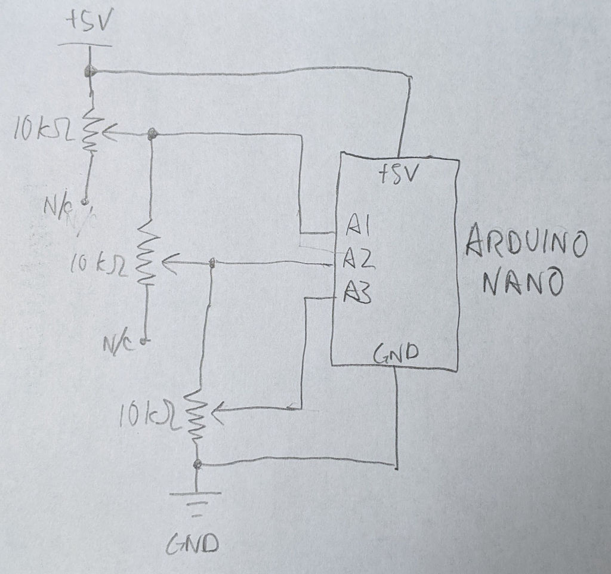

# RDIS Test Stub Sketch

## Purpose

This Arduino sketch is a test stub for development purposes. It represents
a piece of proprietary hardware I do not have, and do not have permission
to disclose details of. This sketch does not include the full range of
functionality, but it implements bare minimum of the serial communication
protocol to let me start writing interop code while the hardware is being
engineered in parallel.

For the sake of generating data that would vary, three potentiometers are
connected to Arduino analog input pins A1, A2, and A3. They are wired so
they will always have voltages in decreasing order.

-------------
## File structure

The directory structure here is a PlatformIO Arduino project, targeting
the
[ATmega328P-based Arduino Nano board with the "new" bootloader.](https://docs.platformio.org/en/latest/boards/atmelavr/nanoatmega328new.html)

While PlatformIO has automatic device detection, it is unreliable on my
machine thus my platformio.ini specifies my serial port. It will need
to be changed on another computer. Alternatively, it may be removed
entirely on computers where auto port detection is reliable.

-------------
## Schematic

I think it is simple and straightforward, but I always think that while
I'm in the middle of the project and a year later have no idea what
was going on. So a quick pencil sketch to jot down the circuit:

